# Diagrama AS-IS — Jornada do Atendimento Pré-Hospitalar no DF

```mermaid
flowchart LR
  %% Styles
  classDef physical fill:#f5f5f5,stroke:#9e9e9e,stroke-width:1px,color:#333
  classDef citizen fill:#e3f2fd,stroke:#1565c0,stroke-width:2px,color:#0d47a1
  classDef frontCbmdf fill:#c8e6c9,stroke:#2e7d32,stroke-width:2px,color:#1b5e20
  classDef frontSamu fill:#a5d6a7,stroke:#1b5e20,stroke-width:2px,color:#1b5e20
  classDef backCbmdf fill:#fff9c4,stroke:#f9a825,stroke-width:2px,color:#e65100
  classDef backSamu fill:#fff176,stroke:#f57f17,stroke-width:2px,color:#e65100
  classDef support fill:#f3e5f5,stroke:#7b1fa2,stroke-width:2px,color:#4a148c
  classDef fail fill:#ffebee,stroke:#c62828,stroke-width:2px,color:#b71c1c,stroke-dasharray:3 3

  %% ===== STEP 1: PRÉ-ACIONAMENTO =====
  subgraph S1["① Pré-Acionamento"]
    direction TB
    S1_PE["📱 Celular<br/>Estado da vítima"]:::physical
    S1_SOL["🧑 Decide qual número<br/>discar (crença prévia)<br/>→ Disca 192 ou 193"]:::citizen
    S1_VIT["👤 Sofre o evento<br/>(mal súbito / trauma)<br/>Se inconsciente: não age"]:::citizen
    S1_FC["—"]:::frontCbmdf
    S1_FS["—"]:::frontSamu
    S1_BC["—"]:::backCbmdf
    S1_BS["—"]:::backSamu
    S1_SUP["—"]:::support
    S1_FP["⚠ Decisão 'fortuita'<br/>(Falha 34)<br/>Ausência de campanha<br/>educativa massiva"]:::fail
  end

  %% ===== STEP 2: ACOLHIMENTO =====
  subgraph S2["② Acolhimento"]
    direction TB
    S2_PE["🎧 Gravação telefônica<br/>Voz do atendente<br/>Nº de protocolo"]:::physical
    S2_SOL["🗣️ Relata emergência<br/>Informa endereço<br/>Responde triagem"]:::citizen
    S2_VIT["(ainda na cena)"]:::citizen
    S2_FC["📞 OPE atende 193<br/>→ Identifica natureza<br/>→ Valida endereço<br/>→ Decide manter ou<br/>transferir ao SAMU"]:::frontCbmdf
    S2_FS["📞 TARM atende 192<br/>→ Triagem protocolada<br/>→ Valida endereço<br/>→ Passa ao Médico<br/>Regulador se grave"]:::frontSamu
    S2_BC["💻 OPE consulta CAD<br/>→ Geolocalização<br/>→ Ocorrências prévias"]:::backCbmdf
    S2_BS["💻 TARM registra<br/>dados no CERU"]:::backSamu
    S2_SUP["🖥️ Sistemas de TI<br/>(CAD / CERU)"]:::support
    S2_FP["⚠ Trote<br/>⚠ Endereço impreciso<br/>⚠ Queda de chamada<br/>⚠ Ping-pong 192/193"]:::fail
  end

  %% ===== STEP 3: REGULAÇÃO / DESPACHO =====
  subgraph S3["③ Regulação / Despacho"]
    direction TB
    S3_PE["🔊 Som de sirene<br/>(se despachado)<br/>Voz do médico<br/>(se orientação)"]:::physical
    S3_SOL["⏳ Aguarda viatura<br/>ou recebe orientação<br/>Pode religar se demorar"]:::citizen
    S3_VIT["🩹 Recebe primeiros<br/>socorros do SOL<br/>(se orientado)"]:::citizen
    S3_FC["—"]:::frontCbmdf
    S3_FS["💬 Médico Regulador<br/>orienta SOL<br/>(apenas baixa<br/>gravidade)"]:::frontSamu
    S3_BC["⚡ Chefe Sala prioriza<br/>fila → aloca viatura<br/>via CAD → Rádio-op.<br/>transmite despacho"]:::backCbmdf
    S3_BS["🩺 Médico Regulador<br/>classifica (PHTLS/ACLS)<br/>→ decide recurso<br/>ou orientação<br/>→ TARM registra CERU"]:::backSamu
    S3_SUP["🖥️ Sistemas de TI<br/>🚛 Gestão de Frota<br/>(disponibilidade)"]:::support
    S3_FP["⚠ Conflito de<br/>priorização (Falha 37)<br/>⚠ Frota indisponível<br/>⚠ Sombra de rádio<br/>⚠ Ping-pong entre<br/>centrais"]:::fail
  end

  %% ===== STEP 4: ATENDIMENTO EM CENA =====
  subgraph S4["④ Atendimento em Cena"]
    direction TB
    S4_PE["🚑 Viatura (USB/USA/UR)<br/>👕 Uniforme, EPI<br/>🛏️ Maca<br/>⚕️ Equipamentos"]:::physical
    S4_SOL["👀 Recebe equipe<br/>Acompanha<br/>Fornece informações"]:::citizen
    S4_VIT["🩻 É examinada<br/>▶ Procedimentos<br/>▶ Preparada p/transporte"]:::citizen
    S4_FC["👨‍🚒 EQP-C estabiliza<br/>→ Procedimentos<br/>→ Comunica c/ vítima<br/>e acompanhantes"]:::frontCbmdf
    S4_FS["👨‍⚕️ EQP-S estabiliza<br/>→ Procedimentos<br/>→ Comunica c/ vítima<br/>e acompanhantes"]:::frontSamu
    S4_BC["📡 RAD/CHF monitora<br/>tempo em cena via CAD"]:::backCbmdf
    S4_BS["🏥 Médico Regulador<br/>consulta Central de<br/>Leitos → define<br/>destino hospitalar"]:::backSamu
    S4_SUP["🖥️ TI atualiza<br/>status 'em cena'"]:::support
    S4_FP["⚠ Cena insegura<br/>⚠ Recusa de transporte<br/>(Falha 35)<br/>⚠ Sombra de rádio<br/>⚠ Retenção de maca<br/>por superlotação"]:::fail
  end

  %% ===== STEP 5: HANDOFF =====
  subgraph S5["⑤ Transferência (Handoff)"]
    direction TB
    S5_PE["🏥 Maca hospitalar<br/>📋 Prontuário<br/>🆔 Pulseira de ID"]:::physical
    S5_SOL["(pode acompanhar<br/>— facultativo)"]:::citizen
    S5_VIT["▶ Transferida para<br/>maca hospitalar<br/>▶ Identificada"]:::citizen
    S5_FC["📋 EQP-C passa caso<br/>ao enfermeiro/médico<br/>plantonista"]:::frontCbmdf
    S5_FS["📋 EQP-S passa caso<br/>ao enfermeiro/médico<br/>plantonista"]:::frontSamu
    S5_BC["📝 EQP-C registra<br/>RAPH; CHF notificado<br/>(viatura liberada)"]:::backCbmdf
    S5_BS["📝 EQP-S registra<br/>RAPH; MED notificado<br/>(viatura liberada)"]:::backSamu
    S5_SUP["🖥️ TI registra<br/>conclusão do<br/>transporte"]:::support
    S5_FP["⚠ Recusa hospitalar/<br/>redirecionamento<br/>(Falha 39)<br/>⚠ Falha de ID do<br/>paciente (Falha 38)<br/>⚠ Handoff incompleto"]:::fail
  end

  %% ===== STEP 6: ENCERRAMENTO =====
  subgraph S6["⑥ Encerramento"]
    direction TB
    S6_PE["📄 RAPH preenchido<br/>📊 Relatório estatístico<br/>(CID, tipo)"]:::physical
    S6_SOL["—"]:::citizen
    S6_VIT["—"]:::citizen
    S6_FC["—"]:::frontCbmdf
    S6_FS["—"]:::frontSamu
    S6_BC["💻 OPE codifica CID<br/>→ Preenche RAPH<br/>→ Baixa viatura CAD<br/>→ Estatística mensal"]:::backCbmdf
    S6_BS["💻 MED/TARM codifica<br/>→ Preenche RAPH<br/>→ Finaliza CERU<br/>→ Estatística mensal"]:::backSamu
    S6_SUP["🖥️ TI finaliza<br/>🚛 Frota: viatura<br/>retorna ao pool<br/>ou manutenção"]:::support
    S6_FP["⚠ Erro de<br/>codificação CID<br/>(impacto estatístico)"]:::fail
  end

  %% ===== CONNECTIONS (interaction points) =====
  S1 --> S2
  S2 --> S3
  S3 --> S4
  S4 --> S5
  S5 --> S6
```

## Notas sobre o Diagrama

| Elemento | Legenda |
|---|---|
| 🧑 Ações do Solicitante | Raia azul |
| 👤 Ações da Vítima | Raia azul |
| 📞 Frontstage CBMDF | Raia verde escuro |
| 📞 Frontstage SAMU | Raia verde claro |
| 💻 Backstage CBMDF | Raia amarelo escuro |
| 💻 Backstage SAMU | Raia amarelo claro |
| 🖥️ Processos de Suporte | Raia roxa |
| ⚠ Fail Points | Raia vermelha tracejada |

**Linhas divisórias (Shostack):**
- **Linha de Interação:** cruzada entre SOL e Frontstage nas Etapas 2 (SOL ↔ Atendente), 3 (condicional: SOL ↔ Médico Regulador) e 4 (EQP ↔ VIT+SOL)
- **Linha de Visibilidade:** entre as raias de Frontstage (verde) e Backstage (amarelo)
- **Linha de Internal Interaction:** entre as raias de Backstage (amarelo) e Suporte (roxo)
