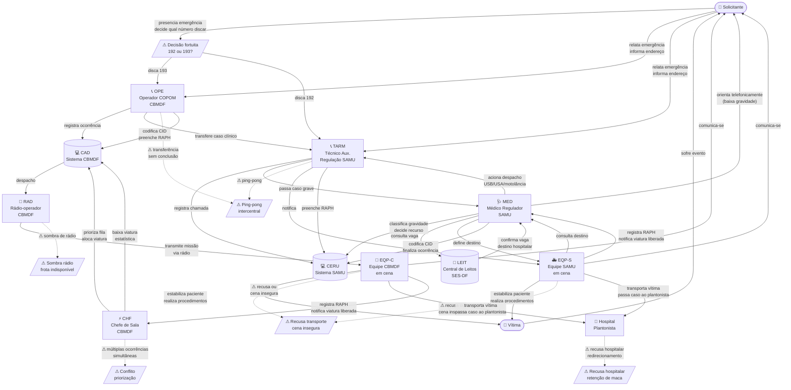

# Diagrama AS-IS — Jornada do Atendimento Pré-Hospitalar no DF

## Legenda de Atores

| Ator | Descrição |
|---|---|
| SOL | Solicitante (cidadão que aciona o serviço) |
| VIT | Vítima (paciente atendido) |
| OPE | Operador COPOM — CBMDF (atende o 193) |
| TARM | Técnico Auxiliar de Regulação Médica — SAMU (atende o 192) |
| MED | Médico Regulador — SAMU |
| CHF | Chefe de Sala / Despachante — CBMDF |
| RAD | Rádio-operador — CBMDF |
| EQP-C | Equipe de ponta CBMDF (bombeiros em cena) |
| EQP-S | Equipe de ponta SAMU (socorristas em cena) |
| LEIT | Central de Leitos — SES-DF |
| CAD | Sistema Computer-Aided Dispatch — CBMDF |
| CERU | Central de Regulação — SAMU |
| HOSP | Hospital / Plantonista receptor |

## Linhas Divisórias (Shostack)

| Linha | Separa |
|---|---|
| **Linha de Interação** | SOL/VIT ↔ OPE/TARM/MED/EQP-C/EQP-S |
| **Linha de Visibilidade** | Frontstage (OPE, TARM, MED orientando, EQP) ↔ Backstage (CHF, RAD, CAD, CERU, LEIT) |
| **Linha de Internal Interaction** | Backstage ↔ Sistemas de Suporte (CAD, CERU, LEIT) |
